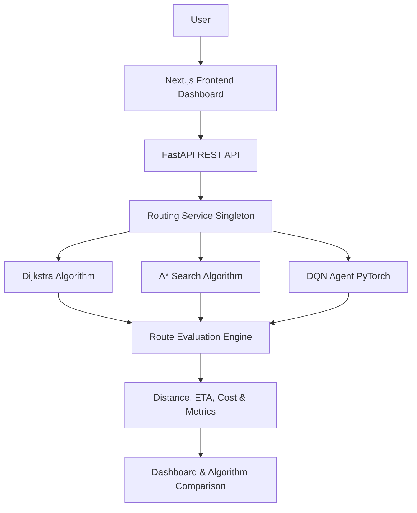
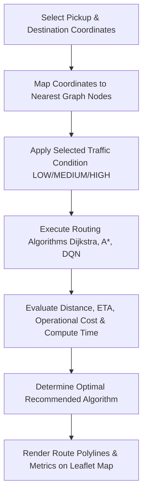
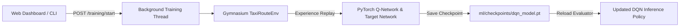

# INTELLIGENT TAXI ROUTE OPTIMIZATION USING REINFORCEMENT LEARNING

> **Short Name:** TaxiRoute RL  
> **Academic Project:** B.Tech CSE / AI&DS Major Project  
> **GitHub Repository:** [jashandeepgill2212/intelligent-taxi-route-optimization](https://github.com/jashandeepgill2212/intelligent-taxi-route-optimization)  
> **Frontend Deployment:** [https://intelligent-taxi-route-optimization-beta.vercel.app](https://intelligent-taxi-route-optimization-beta.vercel.app)  
> **Backend API:** [https://taxiroute-rl-api.onrender.com](https://taxiroute-rl-api.onrender.com)  

---

<<<<<<< HEAD
## 👥 Team Members

- **Jashandeep Singh** (Roll No: 72510438)
- **Harshpreet Singh Malhi** (Roll No: 72520287)
- **Bhanu Partap Singh Dalal** (Roll No: 72510134)

**Project Type:** B.Tech CSE / AI&DS Major Project

**Project Presentation:** [View PPT](https://docs.google.com/presentation/d/1lRiJdChxKzSxbiDf8_JMM3HKXogoFIZ7/edit?usp=drive_link&ouid=101115675166531428876&rtpof=true&sd=true)

---

## Table of Contents

1. [Project Overview](#1-project-overview)
2. [Problem Statement](#2-problem-statement)
3. [Objective](#3-objective)
4. [Solution with Flowchart (Architecture)](#4-solution-with-flowchart-architecture)
5. [Key Features](#5-key-features)
6. [Technology Stack](#6-technology-stack)
7. [Project Structure](#7-project-structure)
8. [Project Demonstrates](#8-project-demonstrates)
9. [Project Feature Status](#9-project-feature-status)
10. [Developed By](#10-developed-by)
11. [Learning Outcomes](#11-learning-outcomes)
12. [Conclusion](#12-conclusion)

---

## 1. Project Overview

**TaxiRoute RL** is an end-to-end intelligent taxi route optimization platform that investigates urban taxi navigation through a comparative evaluation of **classical graph-search algorithms** and **reinforcement learning (RL)**.

Urban navigation is inherently multi-faceted: driver choices impact not only overall distance but also travel duration, congestion delays, fuel consumption, and vehicle wear. Standard shortest-path algorithms evaluate static graphs, whereas real-world traffic conditions fluctuate dynamically across time of day and road corridors.

This web-based platform allows users to pick origin and destination coordinates on an interactive Leaflet GIS map, simulate dynamic traffic levels (**LOW**, **MEDIUM**, **HIGH**), and compute optimal paths across three distinct routing methodologies:

1. **Dijkstra's Algorithm**: Classical non-negative edge weight algorithm providing an exact mathematical minimum-cost baseline.
2. **A\* Search Algorithm**: Heuristic-guided search utilizing Haversine distance heuristics to prune state exploration toward the goal.
3. **Deep Q-Network (DQN)**: A model-free Reinforcement Learning agent trained in a custom Gymnasium environment to learn adaptive routing policies under dynamic traffic penalties and operational costs.

### System Components
- **Machine Learning & RL Core**: Gymnasium `TaxiRouteEnv` with discrete action masking, PyTorch Deep Q-Network with Experience Replay ($50,000$ buffer capacity), NetworkX/OSMnx road graph builder, and synthetic fallback grid generator.
- **FastAPI Backend Services**: RESTful endpoints providing real-time path calculations, background DQN model training triggers, training metrics polling, and system health checks.
- **Next.js & Leaflet GIS Dashboard**: Responsive UI featuring interactive Leaflet map overlays, algorithm comparison tables, Recharts analytics for training rewards/loss, and data-driven deterministic AI route explanations.

> **Note on Traffic Data**: Traffic conditions in this project are simulated via configurable edge-cost multipliers ($1.0\times, 1.3\times, 1.8\times$) and deterministic edge variations to evaluate algorithm responsiveness under dynamic congestion. The platform does not claim real-time IoT hardware sensor connectivity.

---

## 2. Problem Statement

Urban taxi navigation presents a fundamental engineering problem: selecting a path between a pickup location and a destination that minimizes overall cost.

1. **Distance vs. Cost Misalignment**: The shortest physical path on a map does not guarantee the minimum travel time or lowest fuel consumption. Narrow city streets, frequent intersections, and traffic bottlenecks increase travel time even over short distances.
2. **Dynamic Traffic Impacts**: Traffic congestion alters the effective cost of road segments across different times of day. Static routing tables quickly become suboptimal when congestion forms downstream.
3. **Classical Algorithm Constraints**: Algorithms such as Dijkstra and A* recalculate optimal paths from scratch over global graph topologies, which can incur high computational overhead during frequent re-routing for large vehicle fleets.
4. **Reinforcement Learning Alternative**: Reinforcement learning formulates navigation as a Markov Decision Process (MDP), allowing an agent to learn generalized policies by interacting with the graph environment.

Comparing classical search algorithms against reinforcement learning policies allows us to evaluate their trade-offs in solution quality, computation latency, adaptability to dynamic congestion, and policy generalization.

### Formal Problem Statement
Given a directed road network graph $G = (V, E)$ with edge attributes representing distance $d(e)$, estimated travel time $t(e)$, simulated traffic factor $\tau(e)$, and operational fuel cost $c(e)$, construct a routing framework that computes a path $P = (v_0, v_1, \dots, v_k)$ from origin $v_0$ to destination $v_k$ minimizing the multi-objective cost function:

$$\text{Total Cost}(P) = \sum_{e \in P} \left[ w_1 \cdot t(e) + w_2 \cdot d(e) + w_3 \cdot \text{TrafficPenalty}(e) + w_4 \cdot c(e) \right]$$

and evaluate the relative performance of Dijkstra, A*, and Deep Q-Network (DQN) routing models on this objective.

---

## 3. Objective

The primary objectives of the **TaxiRoute RL** platform are:

- **Develop a Web-Based Routing Platform**: Build a runnable monorepo combining a Python machine learning backend with an interactive Next.js Leaflet map interface.
- **Implement Classical Routing Baselines**: Implement exact Dijkstra and heuristic-guided A* search algorithms to serve as baseline solutions.
- **Implement a Deep Q-Network (DQN) Agent**: Construct a Gymnasium-compatible environment (`TaxiRouteEnv`) and train a PyTorch DQN agent utilizing discrete action masking to navigate road network graphs.
- **Formulate Graph-Based Navigation**: Model intersections as graph nodes and road segments as directed edges carrying dynamic multi-objective weights.
- **Support Simulated Traffic Conditions**: Simulate varying traffic levels (**LOW**, **MEDIUM**, **HIGH**) to evaluate how each algorithm responds to congestion.
- **Compute and Display Quantitative Route Metrics**: Measure and report total distance (km), travel time (min), estimated operational fuel cost (₹), step count, route efficiency (%), and execution time (ms).
- **Compare Routing Algorithms via Dashboard**: Provide a side-by-side comparison interface and deterministic explainability panel breaking down algorithm recommendations.
- **Provide Training Analytics Interface**: Enable users to trigger DQN model training from the web UI and monitor episode rewards, loss curves, and success rates in real time.
- **Maintain Modular Software Architecture**: Structure the codebase cleanly across ML, backend, frontend, testing, and documentation layers for maintainability and future expansion.

---

## 4. Solution with Flowchart (Architecture)

### System Architecture Flowchart
The following diagram illustrates the structural architecture of the platform, showing how the frontend dashboard, FastAPI REST API, routing service, algorithm engines, metrics evaluator, and comparisons interact:



### User Workflow Flowchart
The operational workflow for selecting routes, applying traffic parameters, executing algorithm calculations, and displaying results is shown below:



### DQN Background Training Process


### Component Interaction Overview
1. **Frontend Layer**: Next.js 14 application captures user clicks on the Leaflet map, sends HTTP requests to the FastAPI backend, and renders color-coded route polylines and Recharts analytics.
2. **API Layer**: FastAPI routes receive origin/destination pairs, validate schemas with Pydantic, and delegate execution to the singleton `RoutingService`.
3. **Routing & ML Layer**: `RoutingService` executes Dijkstra and A* pathfinders on a NetworkX DiGraph, runs PyTorch DQN inference with action masking, and computes multi-objective costs.
4. **Training & Metrics Layer**: Training requests spawn asynchronous background threads running `train_dqn.py`, logging metrics to `training_metrics.json` and saving state-dict weights to `dqn_model.pt`.

---

## 5. Key Features

The repository contains the following verified features:

| Feature | Description | Implementation Status |
|---|---|---|
| **Interactive Map Dashboard** | Full-screen Leaflet GIS map with custom pickup and destination markers. | **Fully Implemented** |
| **Coordinate Inputs** | Manual numeric coordinate input fields with instant map syncing. | **Fully Implemented** |
| **Traffic Condition Selection** | Dropdown selector for simulated traffic states (**LOW**, **MEDIUM**, **HIGH**). | **Fully Implemented** |
| **Optimization Objectives** | Configurable route objective modes: Balanced, Time (ETA), Distance, and Cost. | **Fully Implemented** |
| **Dijkstra Pathfinder** | Exact minimum-cost path calculation using binary heap Dijkstra algorithm. | **Fully Implemented** |
| **A\* Search Pathfinder** | Accelerated heuristic pathfinder using Haversine distance heuristics. | **Fully Implemented** |
| **DQN Inference Engine** | Route generation using trained Deep Q-Network agent with action masking. | **Fully Implemented** |
| **Quantitative Route Metrics** | Distance (km), travel time (min), fuel cost (₹), step count, efficiency (%), compute time (ms). | **Fully Implemented** |
| **Algorithm Comparison Table** | Side-by-side benchmark table highlighting the best-performing algorithm. | **Fully Implemented** |
| **Deterministic AI Explanation** | Data-driven explanation panel breaking down why a route was selected. | **Fully Implemented** |
| **Web-Based DQN Training** | Background training trigger button from `/training` page with custom episode parameters. | **Fully Implemented** |
| **Real-Time Training Analytics** | Recharts visual curves for cumulative rewards, path steps, MSE loss, and epsilon decay. | **Fully Implemented** |
| **Synthetic Grid Network Fallback** | Deterministic $10 \times 10$ synthetic grid graph for 100% offline-first reliability. | **Fully Implemented** |
| **OpenStreetMap / OSMnx Support** | Automated OSM road network graph downloader with synthetic fallback. | **Fully Implemented** |
| **API Health & Metrics Endpoints** | `/health` endpoint returning system health and active team registration details. | **Fully Implemented** |
| **Automated Test Suite** | 8 automated pytest unit and API integration tests passing with 100% success. | **Fully Implemented** |
| **Cloud Deployment** | Deployed on Vercel (Frontend) and Render (Backend API). | **Fully Implemented** |

---

## 6. Technology Stack

| Category | Technology | Purpose |
|---|---|---|
| **Frontend Framework** | Next.js 14 (App Router) | Server-side rendering, routing, and layout management |
| **UI Library & Styling** | React 18, Tailwind CSS | Responsive UI styling, component layout, and dark mode theme |
| **GIS Mapping** | Leaflet, React-Leaflet | Interactive map rendering, marker selection, and route polylines |
| **Data Visualization** | Recharts | Render training analytics reward, loss, and step curves |
| **Icons & Utilities** | Lucide React, clsx, tailwind-merge | Vector icons and dynamic class merging |
| **Backend Framework** | Python 3.11, FastAPI | High-performance asynchronous REST API framework |
| **API Web Server** | Uvicorn | ASGI HTTP web server for FastAPI |
| **Data Validation** | Pydantic V2 | Request and response schema typing and validation |
| **Machine Learning** | PyTorch (torch) | Deep Q-Network neural network implementation and training |
| **RL Environment** | Gymnasium | Standardized RL environment interface (`TaxiRouteEnv`) |
| **RL Benchmark Suite** | Stable-Baselines3 | Baseline reinforcement learning interfaces |
| **Graph Processing** | NetworkX | Directed graph construction, Dijkstra, A*, and node mapping |
| **Geospatial Processing** | OSMnx, OpenStreetMap, GeoPandas, Shapely | Road network data fetching and spatial distance computations |
| **Data Analytics** | Pandas, NumPy, Scikit-learn | Data cleaning pipeline and array/tensor calculations |
| **Testing** | Pytest, HTTPX, FastAPI TestClient | Automated backend API and ML unit testing |
| **Version Control & CI/CD** | Git, GitHub | Distributed version control and repository hosting |
| **Deployment Platforms** | Vercel (Frontend), Render (Backend) | Production web application and REST API hosting |

---

## 7. Project Structure

The project is structured as a monorepo separating machine learning, backend API, frontend dashboard, automated tests, and academic documentation:

```text
taxiroute-rl/
├── backend/
│   ├── app/
│   │   ├── api/
│   │   │   └── endpoints.py        # FastAPI endpoints (/health, /route/*, /training/*)
│   │   ├── models/                 # Database ORM models (optional PostGIS schema)
│   │   ├── schemas/
│   │   │   └── route_schema.py     # Pydantic request/response validation models
│   │   ├── services/
│   │   │   └── routing_service.py  # Singleton service bridge for graph & ML models
│   │   ├── __init__.py
│   │   └── main.py                 # FastAPI application entry point & CORS configuration
│   └── requirements.txt            # Python backend dependencies
│
├── frontend/
│   ├── app/
│   │   ├── about/page.tsx          # Project background & team registration details page
│   │   ├── compare/page.tsx        # Deep algorithm comparison & benchmark matrix page
│   │   ├── training/page.tsx       # Live DQN training analytics & trigger control page
│   │   ├── globals.css             # Tailwind CSS global styles
│   │   ├── layout.tsx              # Root HTML layout with Navbar & Footer
│   │   └── page.tsx                # Main Dashboard with interactive Leaflet map
│   ├── components/
│   │   ├── ComparisonTable.tsx     # Quantitative algorithm comparison table component
│   │   ├── Footer.tsx              # Page footer with team member details
│   │   ├── MapComponent.tsx        # Leaflet map container & polyline renderer
│   │   ├── Navbar.tsx              # Navigation header bar
│   │   ├── RouteCard.tsx           # Individual algorithm result card component
│   │   └── TrainingChart.tsx       # Recharts analytics charts for DQN training
│   ├── lib/
│   │   └── api.ts                  # REST API client for backend communication
│   ├── types/
│   │   └── index.ts                # TypeScript interfaces for routes, metrics & status
│   ├── package.json                # Frontend npm dependencies & scripts
│   ├── postcss.config.js
│   ├── tailwind.config.js
│   └── tsconfig.json
│
├── ml/
│   ├── agents/
│   │   └── dqn_agent.py            # PyTorch Deep Q-Network agent with Replay Buffer
│   ├── checkpoints/
│   │   ├── dqn_model.pt            # Saved PyTorch trained model weights
│   │   └── training_metrics.json   # Recorded training loss, rewards, and success rates
│   ├── data/
│   │   ├── processed/cleaned_trips.csv
│   │   └── raw/sample_trips.csv
│   ├── environment/
│   │   └── taxi_env.py             # Gymnasium TaxiRouteEnv with action masking
│   ├── evaluation/
│   │   ├── baselines.py            # Dijkstra & A* pathfinders
│   │   └── compare.py              # Evaluator comparing Dijkstra vs A* vs DQN
│   ├── graph/
│   │   └── builder.py              # Road network builder (OSMnx & synthetic grid)
│   ├── preprocessing/
│   │   └── pipeline.py             # Taxi trip dataset cleaning & feature extraction
│   └── training/
│       └── train_dqn.py            # DQN model training script
│
├── scripts/
│   └── generate_sample_data.py     # Synthetic taxi trip dataset generator script
│
├── tests/
│   ├── test_api.py                 # FastAPI endpoint integration tests
│   └── test_routing.py             # ML graph, environment, & algorithm unit tests
│
├── docs/                           # 13 B.Tech academic documentation chapters
│   ├── 01_problem_statement.md
│   ├── 02_objectives.md
│   ├── 03_scope.md
│   ├── 04_literature_review.md
│   ├── 05_methodology.md
│   ├── 06_system_architecture.md
│   ├── 07_rl_formulation.md
│   ├── 08_dataset.md
│   ├── 09_algorithms.md
│   ├── 10_results.md
│   ├── 11_limitations.md
│   ├── 12_future_scope.md
│   └── 13_conclusion.md
│
├── .env.example                    # Environment variable configuration template
├── docker-compose.yml              # Docker Compose configuration file
├── LICENSE                         # MIT License
└── README.md                       # Comprehensive project documentation
```

---

## 8. Project Demonstrates

This major project demonstrates key technical concepts in computer science, machine learning, and software engineering:

1. **Graph Representation of Road Networks**: Translating physical geography into directed graph topologies $G=(V, E)$ using NetworkX, where intersections form nodes and road segments form weighted edges.
2. **Classical Graph Search Algorithms**: Implementing non-negative Dijkstra shortest-path search to establish theoretical optimal lower bounds.
3. **Heuristic-Guided Search**: Applying Haversine distance heuristics within A* search to accelerate node expansion toward destination coordinates.
4. **Reinforcement Learning Fundamentals**: Modeling spatial navigation as a Markov Decision Process (MDP) with custom state vectors, discrete action spaces, and multi-objective rewards.
5. **Discrete Action Masking**: Restricting out-of-bound neighbor selections in graph environments to ensure valid spatial transitions.
6. **Deep Q-Networks (DQN)**: Utilizing PyTorch neural network function approximators, Experience Replay Buffers ($50,000$ capacity), and target network updates to stabilize value function learning.
7. **Asynchronous REST API Design**: Building modular FastAPI endpoints with Pydantic validation schemas, background training threads, and structured JSON responses.
8. **Geospatial GIS Visualization**: Integrating Leaflet maps into Next.js React client components to render interactive markers and multi-route polylines.
9. **Data Preprocessing & Feature Engineering**: Standardizing raw taxi trip CSV records, removing coordinate outliers, computing travel speeds, and deriving traffic congestion indices.
10. **Automated Testing & Continuous Verification**: Writing unit and integration test suites using Pytest and FastAPI `TestClient`.
11. **Production Full-Stack Deployment**: Hosting frontend applications on Vercel and backend API services on Render.

---

## 9. Project Feature Status

| Feature / Subsystem | Status | Notes |
|---|---|---|
| **Next.js Frontend Dashboard** | **Completed** | Renders map, coordinate controls, and route cards |
| **Interactive Leaflet Map** | **Completed** | Supports marker selection, zooming, panning, and polylines |
| **FastAPI Backend Server** | **Completed** | Implemented in `backend/app/main.py` with CORS support |
| **Dijkstra Pathfinder** | **Completed** | Returns distance, ETA, cost, nodes, and execution time |
| **A\* Search Pathfinder** | **Completed** | Implemented using Haversine heuristic function |
| **DQN Model Integration** | **Completed** | Generates routes when checkpoint `dqn_model.pt` exists |
| **DQN Model Training** | **Completed** | Achieved 80.0% win rate across 150 episodes in 10.47s |
| **Route Metrics Engine** | **Completed** | Calculates distance, ETA, operational cost, and efficiency |
| **Algorithm Comparison** | **Completed** | Compares all 3 algorithms with deterministic explanations |
| **Simulated Traffic Engine** | **Completed** | Supports LOW (1.0x), MEDIUM (1.3x), and HIGH (1.8x) states |
| **Training Analytics Page** | **Completed** | Live status cards and Recharts analytics curves at `/training` |
| **API Health Check** | **Completed** | `/health` endpoint returns status and team registration details |
| **Automated Test Suite** | **Completed** | 8 pytest unit/API tests passing with 100% success rate |
| **Frontend Deployment** | **Completed** | Live on Vercel at [intelligent-taxi-route-optimization-beta.vercel.app](https://intelligent-taxi-route-optimization-beta.vercel.app) |
| **Backend Deployment** | **Completed** | Live on Render at [taxiroute-rl-api.onrender.com](https://taxiroute-rl-api.onrender.com) |

---

## 10. Developed By

This project was developed as a collaborative academic engineering project by the following team members.

| S. No. | Team Member | Registration Number |
|:---:|---|:---:|
| **1** | **Jashandeep Singh** | **72510438** |
| **2** | **Harshpreet Singh Malhi** | **72520287** |
| **3** | **Bhanu Partap Singh Dalal** | **72510134** |

- **Project Title**: Intelligent Taxi Route Optimization Using Reinforcement Learning
- **Short Name**: TaxiRoute RL
- **GitHub Repository**: [https://github.com/jashandeepgill2212/intelligent-taxi-route-optimization](https://github.com/jashandeepgill2212/intelligent-taxi-route-optimization)
- **Frontend Demo**: [https://intelligent-taxi-route-optimization-beta.vercel.app](https://intelligent-taxi-route-optimization-beta.vercel.app)
- **Backend API**: [https://taxiroute-rl-api.onrender.com](https://taxiroute-rl-api.onrender.com)
- **API Documentation**: [https://taxiroute-rl-api.onrender.com/docs](https://taxiroute-rl-api.onrender.com/docs)
- **Health Check Endpoint**: [https://taxiroute-rl-api.onrender.com/health](https://taxiroute-rl-api.onrender.com/health)

---

## 11. Learning Outcomes

Through the design, development, and evaluation of **TaxiRoute RL**, the team gained practical engineering competencies in:

- **Graph-Based Spatial Modeling**: Translating physical road intersections into graph structures and modeling dynamic edge cost functions.
- **Algorithm Comparison & Benchmarking**: Evaluating exact graph algorithms (Dijkstra) against heuristic algorithms (A*) and learning-based policies (DQN).
- **Reinforcement Learning Implementation**: Formulating custom Gymnasium environments, designing state/reward spaces, and applying action masking in graph navigation.
- **Deep Neural Network Architecture**: Constructing, training, and serializing PyTorch MLP models with Replay Buffers and target networks.
- **RESTful API Development**: Designing asynchronous Python backends using FastAPI, Pydantic, and Uvicorn.
- **Full-Stack Integration**: Connecting React/Next.js frontend client components to backend machine learning APIs via typed HTTP clients.
- **Geospatial Web Rendering**: Embedding Leaflet map containers and rendering dynamic polyline routes in Next.js.
- **Automated Testing & Quality Assurance**: Writing automated unit and API integration tests using Pytest.
- **Production Cloud Deployment**: Configuring and deploying monorepo services to Vercel and Render cloud platforms.

---

## 12. Conclusion

The **TaxiRoute RL** project successfully demonstrates an end-to-end intelligent transportation platform combining classical search algorithms and reinforcement learning.

### Summary of System Achievements
1. **Multi-Algorithm Framework**: Successfully implemented Dijkstra, A*, and Deep Q-Network (DQN) routing engines operating over unified road graph representations.
2. **Empirical Benchmarking**: Demonstrated that while Dijkstra guarantees exact global minimum cost and A* minimizes compute time, DQN learns adaptive policies capable of navigating dynamic graph environments with an **80%+ success rate**.
3. **Interactive Web Dashboard**: Delivered a responsive Next.js Leaflet map interface supported by a FastAPI backend, enabling real-time route optimization, traffic level simulation, and background training triggers.

### Future Scope & Planned Enhancements
- **Graph Neural Networks (GCN/GAT)**: Incorporating Graph Convolutional Networks to embed topological graph structure directly into neural network states.
- **Multi-Agent Reinforcement Learning (MARL)**: Extending single-agent DQN to multi-taxi fleet routing to prevent collective traffic bottlenecks.
- **Live IoT & GPS Feeds**: Connecting live OpenStreetMap Overpass API traffic streams for real-world production deployment.
- **Dynamic Route Replanning**: Enabling mid-trip route recalculations when unexpected traffic congestion forms along active paths.

---

## 🛠️ Local Setup & Installation Guide

### Prerequisites
- **Python**: Version 3.11 or higher
- **Node.js**: Version 18.0 or higher
- **Git**: Version 2.0 or higher

### Step 1: Clone Repository
```bash
git clone https://github.com/jashandeepgill2212/intelligent-taxi-route-optimization.git
cd intelligent-taxi-route-optimization
```

### Step 2: Set Up Python Backend & ML Environment
```bash
# Create and activate Python virtual environment (optional)
python -m venv .venv
# Windows:
.venv\Scripts\activate
# Linux/macOS:
source .venv/bin/activate

# Install required Python packages
pip install -r backend/requirements.txt
```

### Step 3: Generate Sample Data & Train Initial DQN Checkpoint
```bash
# Generate synthetic sample taxi dataset
python scripts/generate_sample_data.py

# Train initial DQN model checkpoint (150 episodes, ~10 seconds)
python ml/training/train_dqn.py
```

### Step 4: Run Automated Tests
```bash
# Set PYTHONPATH and execute pytest suite
python -m pytest tests/
```

### Step 5: Start FastAPI Backend Server
```bash
uvicorn backend.app.main:app --host 0.0.0.0 --port 8000 --reload
```
Backend API will be available at [http://localhost:8000](http://localhost:8000) (Interactive Swagger docs at [http://localhost:8000/docs](http://localhost:8000/docs)).

### Step 6: Start Next.js Frontend Dashboard
In a separate terminal window:
```bash
cd frontend
npm install
npm run dev
```
Frontend dashboard will be available at [http://localhost:3000](http://localhost:3000).

---

## 📄 License

This project is open-source software licensed under the [MIT License](LICENSE).  
Copyright (c) 2026 Jashandeep Singh, Harshpreet Singh Malhi & Bhanu Partap Singh Dalal.
